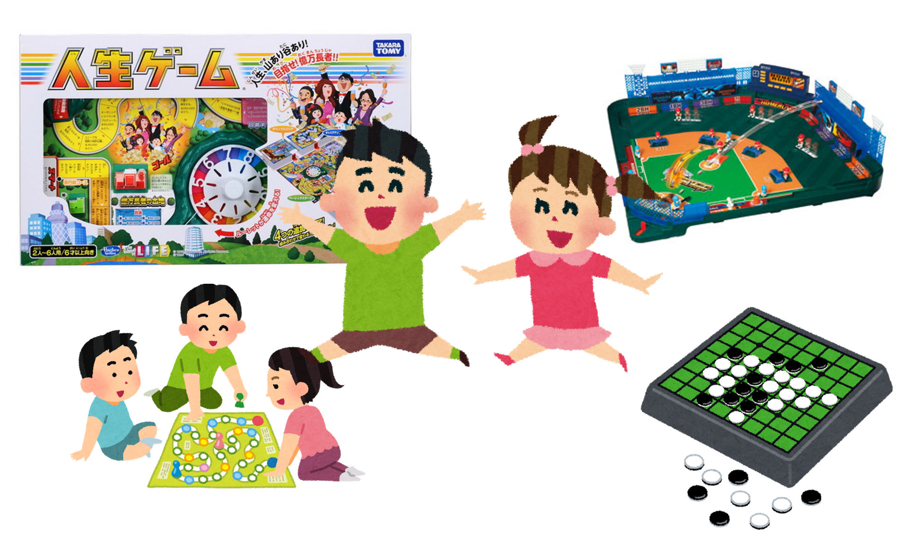
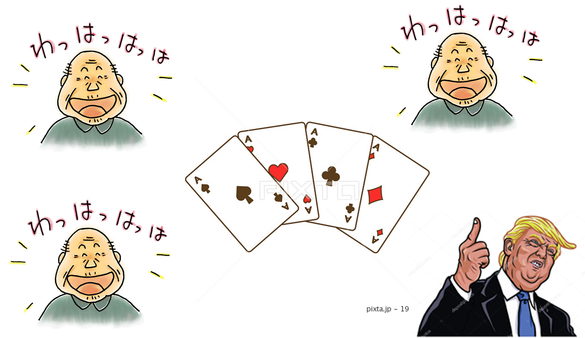

ボードゲーム

---

子供の頃の経験

---
ボードゲームの効果

- 会話のきっかけになる
- 世代問わず楽しめる
- 同じ感動を得られる

---

ボードゲームがないとき

---

ボードゲームがあるとき

---
ボードゲームの今

---
ボードゲームとビジネス

---
ボードゲームの選び方

- 体験
  - ボードゲームカフェ
    <http://jellyjellycafe.com/shoplist/ikebukuro>
  - ボードゲーム市場
- 検索
 - ドイツ年間ゲーム大賞
 - Amazon
 - ボードゲームおすすめサイト

----

おすすめ紹介

- ラブレター
- ファニーデス
- ザ・残業

---